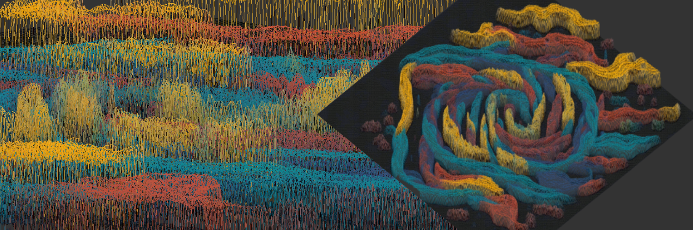

# 🌐 FdF: <i>fil de fer</i> is a programm for 3D wireframe models 🌐

### 🔍 Why FdF?
- Its one of the three first graphic projects in our school.
- We work with an graphics library developed by 42 students for 42 students. Its a very simplistic one with only the basics functionality, like handling windows and putting down pixels on them.
- https://github.com/codam-coding-college/MLX42
- For most of the peeps at my time it was the first time reading documentation.

### ⛓️ FdF made me like graphics
- I spent a lot of time improving my fdf and still it wasnt that great.
- There are way better ones out there mine is so lala
- Still creating visual things with code was really new to me and i really enjoyed the process

  
