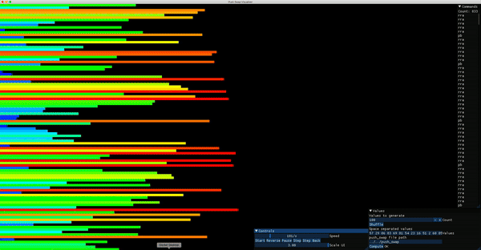

# ♻️ Push_Swap: a sorting algorithm with 2 stacks ♻️

### 🔍 Why Push_Swap?
- Sorting data, sorting numbers - is a thing every computer scientist does once in his life atleast
- Managing a big stack full of numbers is something thats needs to be handled
- The sorting algorithm wanted us to improve on stack operations and not on time optimatzion
- I used insertion sort with an grouping of number in a same range. My stacks were linked lists.

### 🥬 Is optimizing an copied algorithm fun? ...
- ... maybe but not for me. I only made my algorithm so good that i would pass. That means 86 points out of 125
- Sorting numbers is nice but only going for least stack operations didnt make sense in my head. At that time i thought, that run time would be the most important thing for a succesful sorting algorithm, which turned out to be wrong.

### 🛠️ Optimization
- Was done in a visualizer programm, which was developed by a other student from 42
- I tried to build my own but sadly failed because of laziness :)

