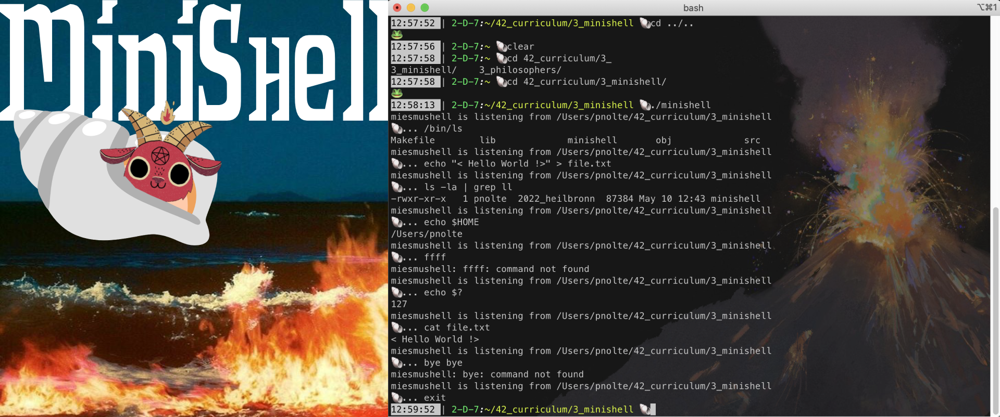
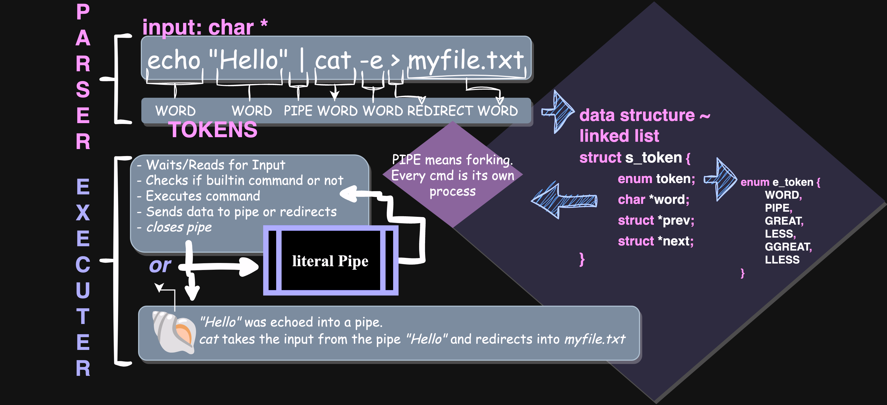

# 🐚 Minishell: Recreating a simple shell 🐚



### 🔍 Why Minishell:
- Its the first team project
- The Shell is based on bash and should recreate its behaviour
- You learn UNIX shell commands and get a deeper knowledge of how the shell/cmd of your PC works in detail
- Its a project without a end, a endless hole. Some of us called it Minihell :>

### 🦖 The Adventure:
- My teammate <a href="https://github.com/amorvai" target="_blank">Annamaria Morvai</a>
- We worked on it for 2-3 Months, with some breaks
- A lot of refactoring and rewriting of functions
- And a lot of git problems since this was my first time coworking with github
- Almost forgot the endless amount of bugs

### ⚙️ How it works:



- Needs Readline to work
- Ubuntu Install 
```
sudo apt-get install libreadline8
sudo apt-get install libreadline-dev
```