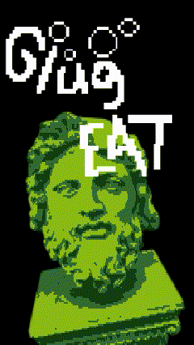
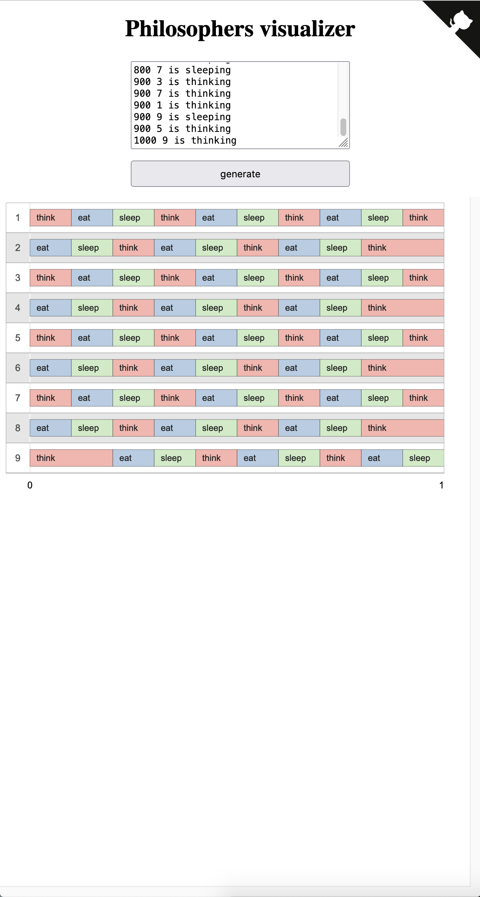
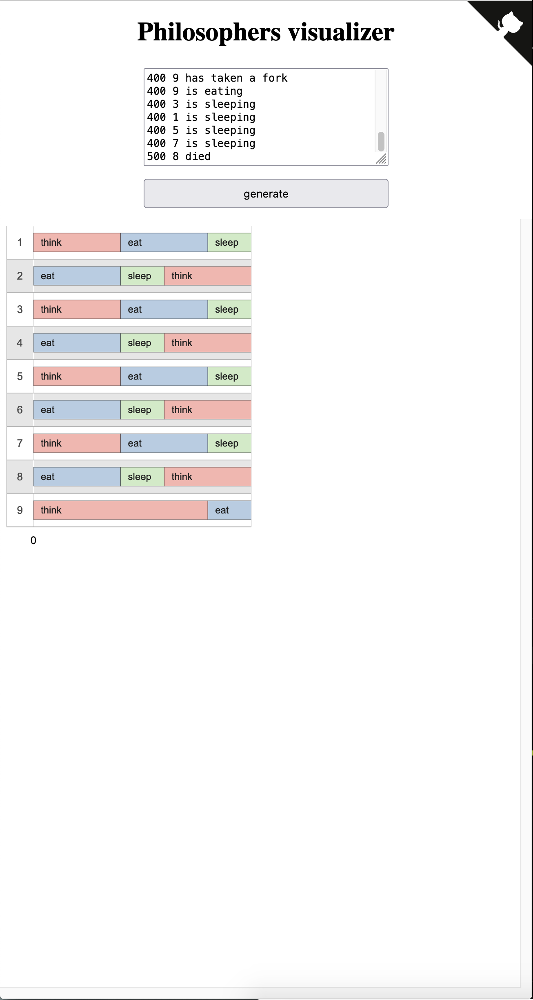

# 🗿 Philosophers: Learning the Ways of Philosophers [Threads] 🗿

### 🔍 Why Philosophers:
- Learn about threads.
- Create a logical program that runs with a custom number of threads.
- Understand the challenges of thread debugging.
- Master thread safety, which is crucial in programming.

---

### 📜 The Rules:

- **Setup:** Philosophers sit around a table with a bowl of spaghetti and as many forks as philosophers.
- **Activities:** Philosophers can eat, think, or sleep, but only one activity at a time.
- **Eating:** To eat, a philosopher needs two forks (right and left). After eating, they put the forks back and go to sleep.
- **Sleeping and Thinking:** After sleeping, they wake up and start thinking. After thinking, they may want to eat again.
- **Rules:** Philosophers don't communicate with each other and don't know if another is about to starve. They need to eat regularly to avoid starvation.
- **Goal:** Ensure that all philosophers get to eat and none of them starves.
- **Implementation:** Every philosopher is a thread. The program parses the following input:
  - `number_of_philosophers`
  - `time_to_die`
  - `time_to_eat`
  - `time_to_sleep`
  - `[number_of_times_each_philosopher_must_eat]`

---

## 🧘 What It Does:

The left images shows an input of `./philo 9 1000 200 200 3`. Since the logic works everyone survives and the programm finishes when everyone ate 3 times. 
The right images shows an input of `./philo 9 500 200 100`. Since we atleast need more than double the amount of `time_to_eat + time_to_sleep` for `time_to_die`, a philo dies, cause there is a uneven amount of philos and only 9 forks.
