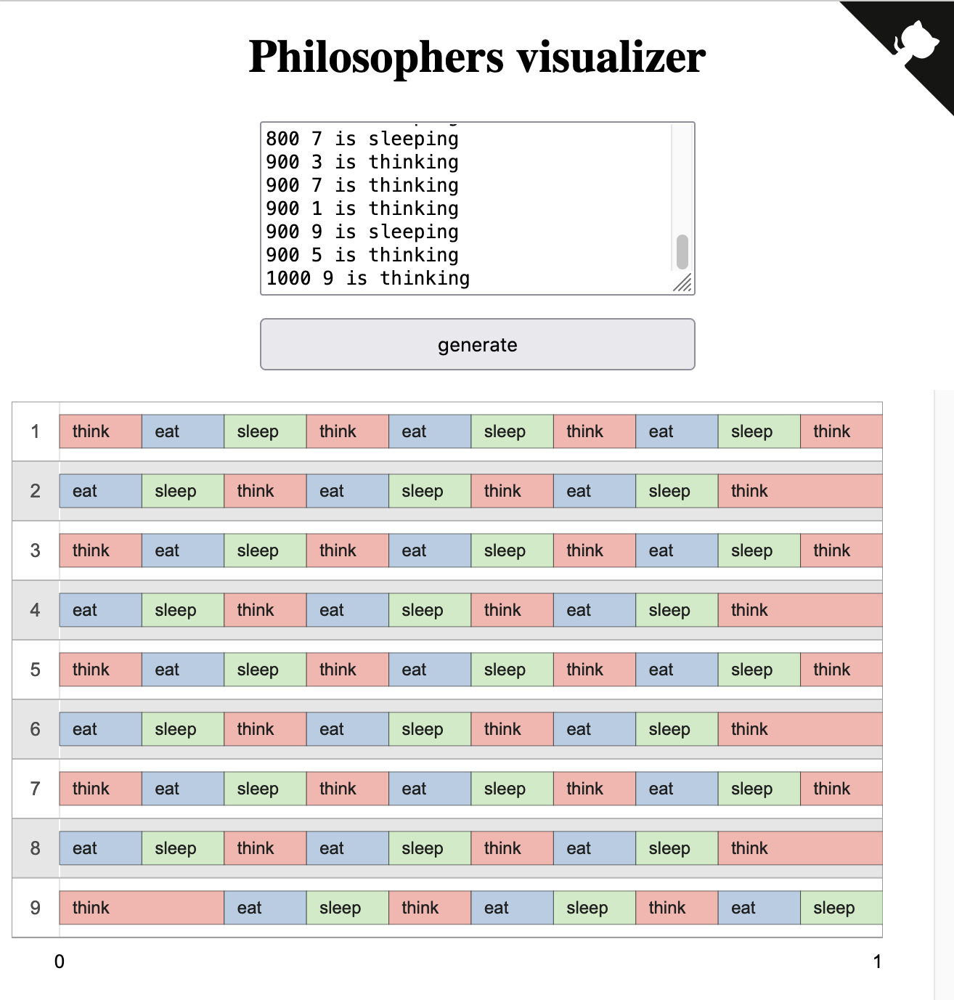
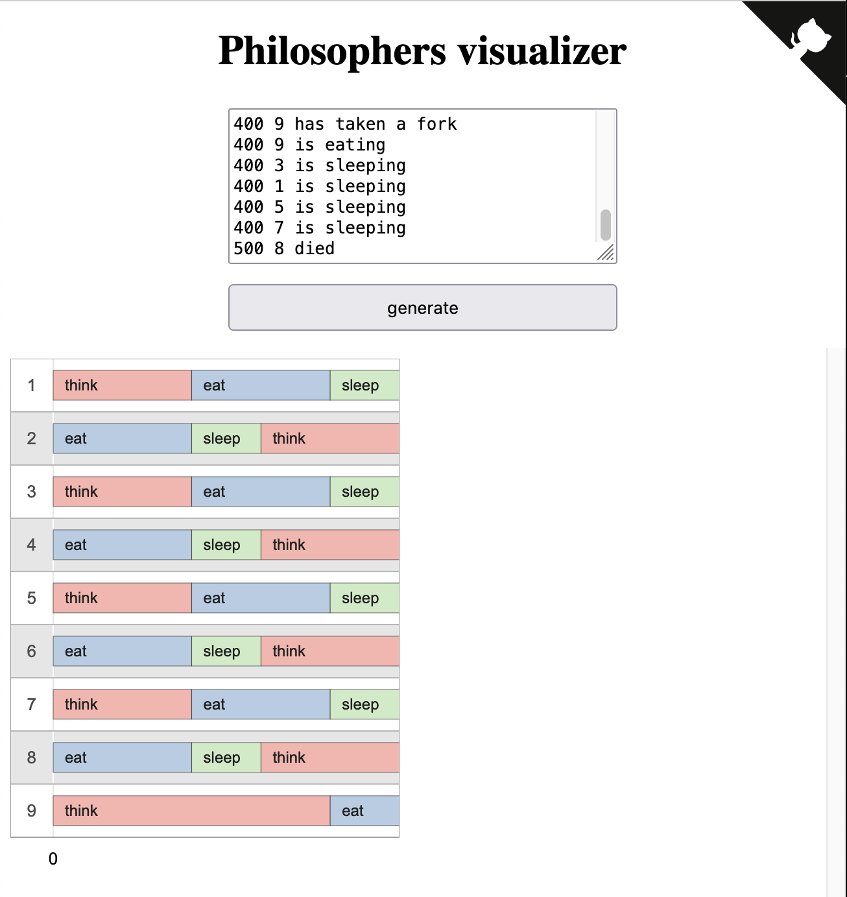

# 🗿 philosophers: learning the ways of philosophers [threads] 🗿

  

### 🔍 Why philosophers:
- You learn about threads
- Creating a logical programm which runs with custom amount of thread
- Get to know how hard thread debugging can be
- Thread safety is the <i>A und O</i>>, how we would say in german

### 📜 The Rules:
  Setup:
      Philosophers sit around a round table.
      There is a bowl of spaghetti in the middle of the table.
      There are as many forks as there are philosophers.
  Activities:
      Philosophers can eat, think, or sleep.
      They can only do one of these activities at a time.
  Eating:
      To eat, a philosopher needs two forks: the one on their right and the one on their left.
      After eating, they put the forks back and go to sleep.
  Sleeping and Thinking:
      After sleeping, they wake up and start thinking.
      After thinking, they may want to eat again.
  Rules:
      Philosophers don't communicate with each other.
      They don't know if another philosopher is about to die of starvation.
      Philosophers need to eat regularly to avoid starvation.
  Goal:
      Ensure that all philosophers get to eat and none of them starves.
  
  Implementation:
      Every philosopher is a thread.
      And this the Input which our programm needs to parse: 
        - number_of_philosophers 
        - time_to_die 
        - time_to_eat 
        - time_to_sleep 
        - [number_of_times_each_philosopher_must_eat] <i>optional<i>

### 🧘 What it does:

