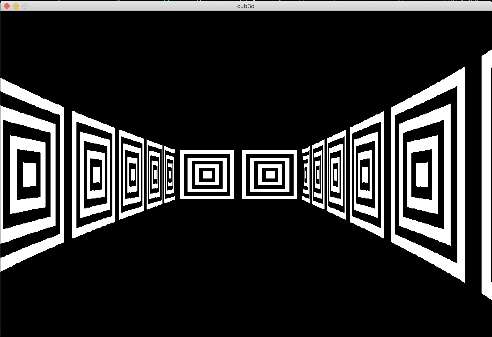
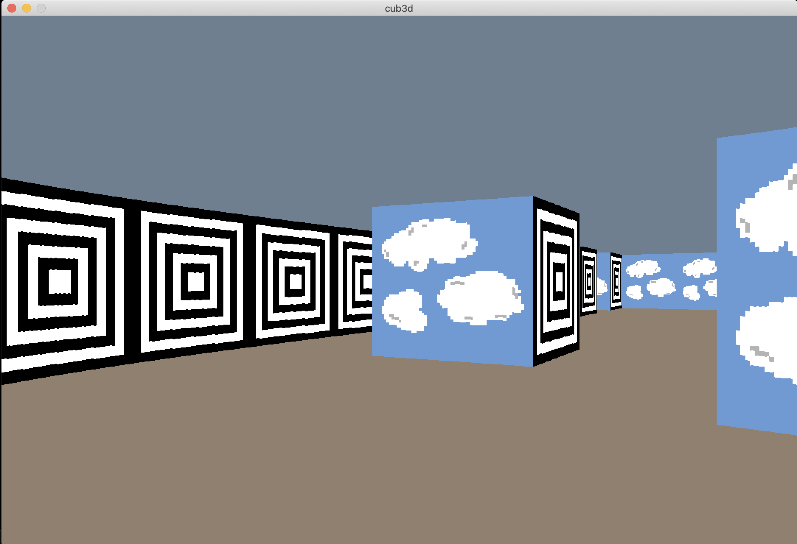

# 🎮 Cub3D: A Wolfenstein 3D copy 🎮

### 🔍 Why Cub3D:
- It is the second graphic project
- Build a own raycaster, its not a raytracer
- Again a group project. My partner <a href="https://github.com/jweeeezy" target="_blank">Jakob Willert</a>

### 🕹️ How it works:

  
  

- Wiki 📖:
The video game Wolfenstein 3D was built from a square based grid of uniform height walls meeting solid-colored floors and ceilings. In order to draw the world, a single ray was traced for every column of screen pixels and a vertical slice of wall texture was selected and scaled according to where in the world the ray hits a wall and how far it travels before doing so.

The purpose of the grid based levels was twofold — ray-wall collisions can be found more quickly since the potential hits become more predictable and memory overhead is reduced. However, encoding wide-open areas takes extra space. 
- Texture were hard, needed to scaled and traversed to fit into each colomn of wall
