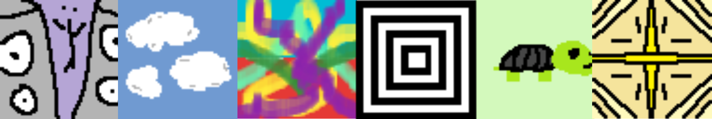

# 🎮 Cub3D: A Wolfenstein 3D copy 🎮

### 🔍 Why Cub3D:
- It is the second graphic project
- Build a own raycaster, its not a raytracer
- Again a group project. My partner <a href="https://github.com/jweeeezy" target="_blank">Jakob Willert</a>

### 🕹️ How it works:
- We have a game map, called <i>.cub</i>. Our parser only accepts correct formatted <i>.cub</i> file

   

 

- From that map we get a player position and the current viewing direction
- We can now calculate for every column of screen pixel the distance to the wall from our current player position
- With this we scale the height of the wall accordingly to its travel distance

   

 
 

- Since programming something like this it involves bugs

   

 

- Texture were hard to add. They needed to be scaled and traversed to fit into each colomn.
- This gave me a better understanding of how pictures files work.
- A collection of our weird selfmade texture 

