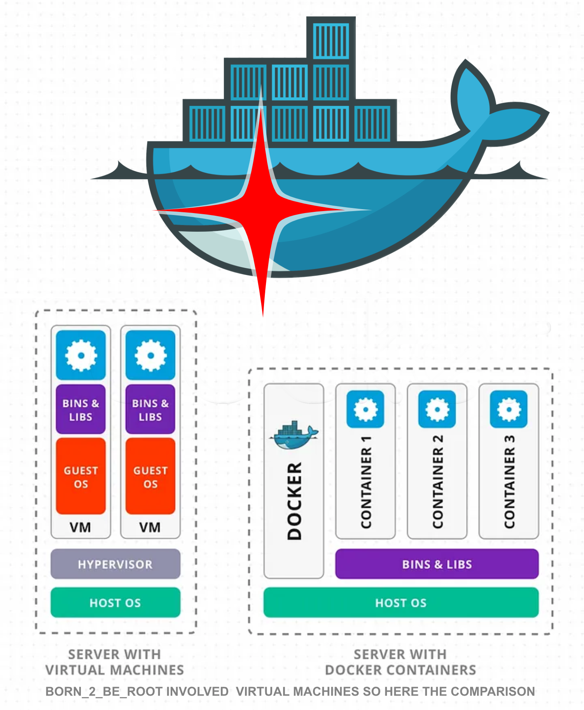
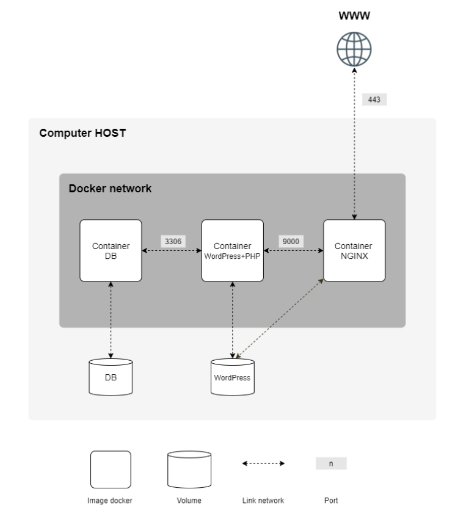

# 🐋 <b>I N C E P T I O N</b>: creating a web stack with docker 🐋

### 🔍 Why inception:
- First contact with docker and containerrization.
- Well containers are powerful, you have to many users and your code runs poorly? Just create a second one or three or four i mean there is no limit.
- Besides that the project focused more on creating a tech stack with different softwares, each should be their own container
- Nginx, MariaDB and WordPress needed to be configured and setup which should all be composeable with a Makefile

### 🍱 Building a Bento box :
<b><i>`was hard`</b></i> 
Since the subject wanted us to setup a lot of different things inside each container it was a hard task to complete. You also needed to get the containers working in a virtual machine which shouldnt be a big problem. Until you notice the problematic implemantation of virtual machine inside our school, or maybe i was just a little bit dumb. To get the container like the should be and connect them between them so they could communicate was a other struggle. Each container with their own script and config, where the only help was really looking into others people inception and inspire on how they did it.
At the end it was still something that teaches you a lot about our Internet world today.

### ⚙️ How it is build visualized in a diagram:

### 🧪📰 🧐 My research:
https://hanwenzhang123.medium.com/docker-vs-virtual-machine-vs-kubernetes-overview-389db7de7618