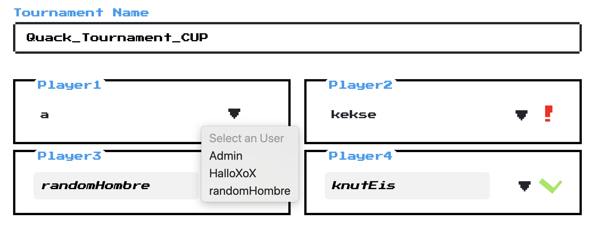

# 🕹️ft_transcendence: transcend into web 🕹️

### 🔍 Why ft_transcendence:
- It is currently the last project at 42Heilbronn at first web project.
- We were five people working on it for circa 3 months.
- Teammates: [<a href="https://github.com/lakner" target="_blank">lakner</a>], [<a href="https://github.com/albert2804" target="_blank">albert2804</a>], [<a href="https://github.com/Kathinka42" target="_blank">Kathinka42</a>], [<a href="https://github.com/Tilmanfs95" target="_blank">Tilmanfs95</a>]
- Using the knowledge of inception to build a webStack with Django as backend, Nuxt.js as frontend, Nginx for our web server, PostgresSQL as database and adminer for database management.
- A lot of new things in a big team, sounds exciting, aint it?

### 🏗️ What we exactly did:





### 🎫Usage:
You need Docker. 

The environment variables should be assigned in the .env file. For Development or Production set the variables inside the .env⤵️
<b>For Development</b>
```
NODE_ENV=development
DJANGO_SETTINGS_MODULE=backend.settings.development
```
- The development frontend server updates the changes automatically.
- The backend server needs to be restarted to update the changes.
<b>For Production</b>
```
NODE_ENV=production
DJANGO_SETTINGS_MODULE=backend.settings.production
```
- To update the frontend changes, you need to run 'npm run build' and restart the frontend server.
- The backend server needs to be restarted to update the changes.

Start all containers:
```
make
```
connect via `https://localhost/`
